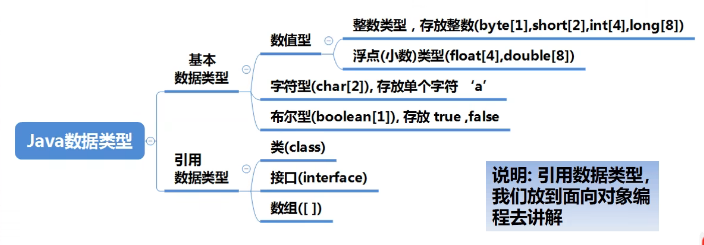
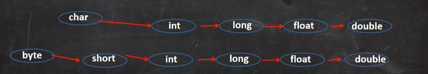
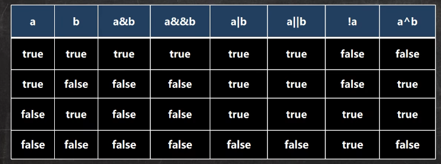
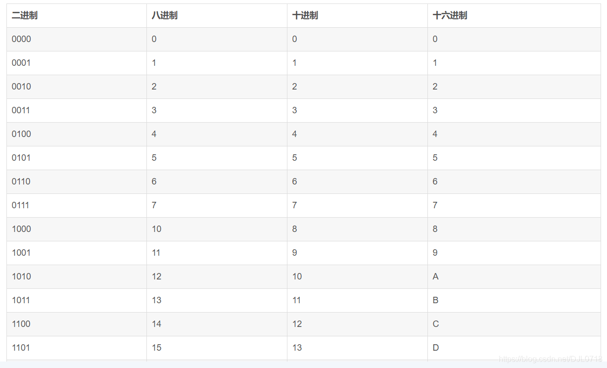
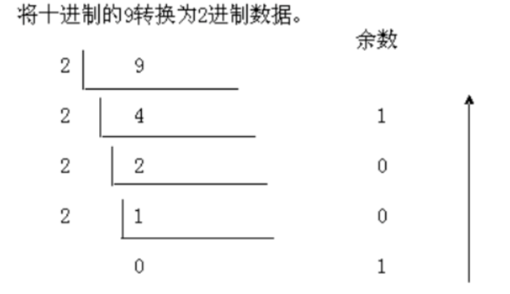
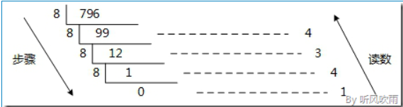
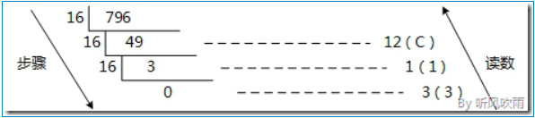

# 基本数据类型

## 变量

### 变量的概念

变量是程序的基本组成单位

变量相当于内存中一个数据存储空间的表示，可以把变量看作是一个房间的门牌号，通过门牌号可以找到房间，而通过变量名可以访问到变量的值

~~~java
//变量有三个要素(类型+名称+值)
class Demo{
    public static void main(String[] args){
        int a = 1;  //定义了一个变量，类型int类型，名称a，值1
        a = 22;  //把22赋给名称为a的变量
        System.out.println(a);  //输出a变量的值
    }
}
~~~

#### 变量使用注意事项

1. 变量表示内存中的一个存储区域(不同变量，类型不同，占用空间大小不同，如int 4字节，double 8字节)
2. 该区域有自己的名称(变量名)和类型(数据类型)
3. 变量必须先声明，后使用
4. 该区域的数据/值可以在**`同一类型`**范围内不断变化
5. 变量在`同一个作用域`内不能重名
6. 变量 = 变量名 + 值+ 数据类型

#### 程序中+号的使用

1. 当左右两边都是数值类型，则加法运算。
2. 左右两边一方为字符串，则拼接运算。
3. 运算顺序，从左到右

~~~java
//下面代码输出什么？
System.out.println(100+90);     //190
System.out.println("100"+90);   //10090
System.out.println(100+3+"90"); //10390
System.out.println("3"+100+90); //310090
~~~

### 数据类型

每个数据类型在内存中都分配了不同的大小空间(字节)



1.  Java数据类型分为两大类，基本数据类型和引用数据类型。
2.  基本数据类型有八种，数值型：byte，short，int，long，float，double，char，boolean。
3.  引用数据类型：类，接口，数组。

#### 整数类型

| 类型          | 占用存储空间 | 范围                                         |
| ------------- | ------------ | -------------------------------------------- |
| byte(字节)    | 1字节        | -128~127                                     |
| short(短整型) | 2字节        | -2^15~ 2^15-1  <br />-32768 ~23767           |
| int(整型)     | 4字节        | -2^31~ 2^31-1  <br />-2147483648 ~2147483647 |
| long(长整型)  | 8字节        | -2^63~ 2^63-1                                |

**整数的使用细节**

1. Java各整数类型有固定的范围和字段长度，不受具体OS[操作系统]的影响，以保证java程序的可移植性。
2. Java整型常量(具体值)默认为int类型，声明long类型常量需在后面加"l"或“L”。
3. Java程序中变量常声明为int类型，除非不足以表示的大数才使用long。
4. bit：计算机最小的存储单位。byte：计算机中最基本的存储单元。   = 8bit。

#### 浮点类型

java的浮点类型可以表示一个小数，如：12.23，3.14，1.1等

| 类型         | 占用存储空间 | 范围                   |
| ------------ | ------------ | ---------------------- |
| 单精度float  | 4字节        | -3.403E38~3.403E38     |
| 双精度double | 8字节        | -1.798E308 ~ 1.798E308 |

1. 关于浮点数在机器中的存放形式，浮点数 = 符号位 + 指数为 + 尾数位
2. 尾数位可能丢失，造成精度损失

#### 浮点型使用细节

1. 与整数类型类似，Java的浮点类型也有固定的范围和字段长度，不受具体的系统影响

   [float4字节，double8字节]

2. Java浮点常量默认为double，声明float常量需要加“f”，或 “F”

3. 浮点型常量有两种表示形式

   十进制形式：5.12，.512，512.0f(必须有小数点)

   科学计数法：5.12e2【5.12*10的2次方】，5.12E-2【5.12/10的2次方】

4. 通常情况下，使用double，因为比float更加精准

5. 浮点数陷阱：2.7和8.1/3比较

#### 字符类型(char)

字符类型可以表示`单个字符`，字符类型是char，char是两个字节(可以存放汉字)，多个字符我们使用字符串String。

~~~java
char c1 = 'a';
char c2 = '\t';
char c3 = '赵';
char c4 = 97;//字符类型可以直接存放一个数字
System.out.println(c1);//a
System.out.println(c2);//制表位         
System.out.println(c3);//赵
System.out.println(c4);//a
~~~

#### 字符的使用细节

1. 字符常量是单引号( ‘   ’  )括起来的单个字符。如：char  a  = ‘a’;

2. Java中还允许使用转义字符 ' \ ' 来将其后面的字符转变为特殊字符型常量。如：char a = ‘\n’;

3. Java中，char的本质是整数，默认在输出时，是unicode码对应的字符
   要输出数字，可以使用（int）字符

4. 可以直接给char赋一个整数，然后输出时会按照unicode字符输出。如：97 -》a

   ~~~java
   char c1 = 97;
   System.out.println(c1);//a
   
   char c2 = 'a';
   System.out.println((int) c2);//97
   ~~~

5. char类型是可以进行运算的，相当于一个整数，因为它都有对应的Unicode码

#### 字符编码

1. 字符型存储到计算机中，需要将字符对应的码找出来，如：‘a’

   存储：‘a’ --》码值97--》二进制(1100001)--> 存储

   读取：二进制(1100001) --> 97 --> 'a'

2. 字符和字符码对应关系是通过字符编码表决定的。

3. 介绍一下字符编码表

   ASCII：ASCII编码表一个字节表示，一个128个字符，实际上一个字节可以表示256个字符，但是只用128个。

   Unicode：Unicode编码表，固定大小的编码，使用两个字节表示字符，字母和汉字都是占用两个字符，浪费空间。

   utf-8：大小可变的编码，字母使用一个字节，汉字用三个字节。

   gbk：可以表示汉字，范围很广，字母1字节，汉字2字节。

   gb2312：可以表示汉字。 gb2312< gbk。

   big5：繁体中文，台湾，香港。

#### 布尔类型

1. 布尔类型也叫boolean类型，boolean类型数据只允许true或false，无null。
2. boolean类型占1个字节。
3. boolean类型适用于逻辑运算，一般用于程序流程控制等。

#### 基本数据类型转换(自动)

当Java程序在进行赋值或者运算时，精度小的类型自动转换为精度大的数据类型。



#### 自动类型转换细节

1. 有多种类型的数据混合运算时，系统首先自动将所有数据转换成容量最大的那种数据类型，然后再进行计算

   ~~~java
    int a = 12;
   float b = a + 1.2; //错误，a+1.2 -->结果类型是double
   double d = a + 1.3; //正确 a+1.3 --> 结果类型double
   float c = a + 1.5F; //正确 a+1.5F --> 结果类型是float
   ~~~

2. 把精度(容量)大的数据类型赋值给精度(容量)小的数据类型时，就会报错，反之就会进行自动类型转换

   ~~~java
    //int aa = 11.2; 错误 double --> int
   ~~~

3. (byte,short)和char之间不会相互自动转换

   ~~~java
    byte bb = 126; //正确 -128 ~ 127
   int n2 = 1;//n2是int
   //byte bbb = n2; //错误，原因是变量赋值，判断类型
   //char c1=bb;//错误，原因byte不能自动转成char
   ~~~

4. byte，short，cahr 三者可以计算，计算时首先转换为int类型

   ~~~java
    byte b2 = 1;
   short s1 = 1;
   //short cc = b2 + s1;错误，b2+s1 => int
   int cc = b2 + s1;//对
   ~~~

5. Boolean不参与转换

6. 自动类型提升：表达式结果的类型自动提升为操作数中最大的类型

#### 强制类型转换

自动类型转换的逆过程，将容量大的数据类型转为容量小的数据类型，使用时加上强转符“（）”，但是精度会降低或溢出

~~~java
 //强制类型转换
int n1 = (int) 1.9;
System.out.println("n1=" + n1);//1,造成精度损失

int n2 = 2000;
byte b1 = (byte) n2;
System.out.println(b1);//造成精度溢出
~~~

#### 强制类型转换细节

1. 当进行数据的大小从大——>小，就可以使用到强制类型转换

2. 强制符号只针对于最近的操作数有效，往往会使用小括号提升优先级

   ~~~java
    //int x = (int)10 * 3.5 + 6 * 11;错误，double ——> int
   int y = (int) (10 * 3.5 + 6 * 11);
   System.out.println(y);//101
   ~~~

3. char类型可以保存int的常量值，但不能保存int的变量值，需要强转

   ~~~java
   char c1 = 100;//ok
   int m = 100;//ok
   //char c2 = m;//错误
   char c3 = (char) m;//ok
   System.out.println(c3);//100对应的ASCII字符
   ~~~

4. byte和short类型在进行运算时，当做int类型处理

#### 基本数据类型和String类型的转换

开发中我们经常需要将基本数据类型转为String类型，或将String类型转为基本数据类型

1. `基本数据类型转String类型`：将基本类型的值+“ ”即可

   ~~~java
   int n1 = 100;
   float f1 = 1.1F;
   double d1 = 4.5;
   boolean b1 = true;
   String s1 = n1 + "";
   String s2 = f1 + "";
   String s3 = d1 + "";
   String s4 = b1 + "";
   System.out.println(s1 + " " + s2 + " " + s3 + " " + s4);
   ~~~

2. `String转基本数据类型`：通过基本类型的包装类调用parseXX方法即可

   ~~~java
   String n = "123";
   int num1 = Integer.parseInt(n);
   double num2 = Double.parseDouble(n);
   System.out.println(num1);//123
   System.out.println(num2);//123.0
   ~~~

3. 把字符串转成字符char -> 含义是指 把字符串的第一个字符得到

   ~~~java
    //得到字符串的一个字符，字符串的编号从0开始，取第几个就输入对应下表
   System.out.println(n.charAt(0));
   ~~~

#### javaAPI文档

1. APi(Application Programming Interface)应用程序编程接口，是Java提供的基本编程接口。
2. Java语言提供了大量的基础类，因此Oracle公司也为这些基础类提供了相应的API文档，用于告诉开发者如何使用这些类，以及类中包含的方法。

### 运算符

运算符是一种特殊的符号，用以表示数据的运算，赋值和比较等。

#### 算数运算符

| 运算符 |          运算          |    范例     |   结果   |
| :----: | :--------------------: | :---------: | :------: |
|   +    |          正号          |     +7      |    7     |
|   -    |          负号          |  b=11; -b   |   -11    |
|   +    |           加           |     9+9     |    18    |
|   -    |           减           |    10-8     |    2     |
|   *    |           乘           |     7*8     |    56    |
|   /    |           除           |     9/9     |    1     |
|   %    |       取模(取余)       |    11%9     |    2     |
|   ++   | 自增(前)：先运算后取值 |  a=2;b=++a  | a=3;b=3  |
|   ++   | 自增(后)：先取值后运算 |  a=2;b=a++  | a=3;b=2  |
|   --   | 自减(前)：先运算后取值 |  a=2;b=--a  | a=1;b=1  |
|   --   | 自减(后)：先取值后运算 |  a=2;b=a--  | a=1;b=2  |
|   +    |       字符串相加       | “666”+“222” | “666222” |

**注意细节**

- 对于除号，它的整数和小数除有区别的；整数之间做除法时，只保`留整数部分`而`舍弃小数部分`。如：int x = 10/3，结果3。

- 当对一个数取模时，可以等价 `a%b = a - a/b*b`,取余的符号取决于被除数

- 当自增当作一个独立语言使用时，不管++i；还是i++，都是一样的。

- 当自增(自减同理)当作一个表达式，j = ++i；等价于先i+1，再将结果赋给j

- 当自增(自减同理)当作一个表达式，j = i++; 等价于先i赋给j，再将i值+1

- ++或--运算结果赋值给自身

  ~~~java
  //计算机看到”=”右边是后缀形式的自增，因此以”先引用后自增”的规则进行运算，先把a的值存入操作数栈，紧接着对a进行自增操作，a的值变成了3，最后又用操作数栈中的那个2对a进行赋值，a的值又变成了2
  int a=2;//i->1
  a=a++;//规则使用临时变量：（1）temp=a;(2)a=a+1;(3)a=temp;
  System.out.println(a);//2
  
  int a=2;//i->1
  a=++a;//规则使用临时变量：（2）temp=a;(1)a=a+1;(3)a=temp;
  System.out.println(a);//3
  //以上代码的第2条语句，对a进行了前缀形式的自增，然后又赋值给a自身，那么a的值是多少呢？因为a进行的是前缀形式的自增，所以运算规则是”先自增后引用”，自增之后a的值变成了3，把3存入操作数栈，之后以3赋值给a，所以a的值还是3。
  ~~~

#### 关系运算符(比较运算符)

1. 关系运算符的结果都是Boolean型，也就是要么是true，要么是false
2. 关系表达式经常用在if结构的条件中或者循环结构的条件中

|   运算符   |        运算        |          范例           | 结构  |
| :--------: | :----------------: | :---------------------: | :---: |
|     ==     |        相等        |          8==7           | false |
|    ！=     |       不等于       |          8！=7          | true  |
|     <      |        小于        |           8<7           | false |
|     >      |        大于        |           8>7           | true  |
|     <=     |      小于等于      |          8<=7           | false |
|     >=     |      大于等于      |          8>=7           | true  |
| instanceof | 检查是否是类的对象 | “hsp” instanceof String | true  |

- 关系运算符的结果boolean型，也就是要么是true，要么是false
- 比较运算符“==”不能写为“=”
- 关系运算符组成的表达式，我们称为关系表达式；a > b

逻辑运算符

用于连接多个条件(多个关系表达式)，最终的结果也是Boolean值

- 短路与 &&，短路或 ||，取反 ！
- 逻辑与 &，逻辑或 | ，逻辑异或 



**1.&&和&基本规则**

| 名称     | 语法         | 特点                         |
| -------- | ------------ | ---------------------------- |
| 短路与&& | 条件1&&条件2 | 两个条件都为true，结果为true |
| 逻辑与&  | 条件1&条件2  | 两个条件都为true，结果为true |

使用区别

1. &&短路与：如果第一个条件为false，则第二个条件不会判断，最终结果为false，效率高

2. &逻辑与：不管第一个条件是否为false，第二个条件都要判断，效率低

3. 开发中，使用短路与&&，效率高

   ~~~java
   int a = 4;
   int b = 9;
   //如果第一个条件为false，则第二个条件不会判断，最终结果为false，效率高
   if (a < 1 && ++b < 50) {
       System.out.println("ok22");
   }
   System.out.println("a=" + a + " b=" + b);//4 9
   
   //不管第一个条件是否为false，第二个条件都要判断，效率低
   if (a < 1 & ++b < 50) {
       System.out.println("ok22");
   }
   System.out.println("a=" + a + " b=" + b);//4 10
   ~~~

**2.|| 和 | 基本规则**

| 名称       | 语法           | 特点                             |
| ---------- | -------------- | -------------------------------- |
| 短路或\|\| | 条件1\|\|条件2 | 两个条件只有一个成立，结果为true |
| \| 逻辑或  | 条件1\|条件2   | 只要有一个条件成立,结果为ture    |

使用区别

- ||短路或：如果第一个条件为true,则第二个条件不会判断，最终结果为true，效率高

- | 逻辑或：不管第一个条件是否为true，第二个条件都要判断，效率低

- 开发中，使用`||`

  ~~~java
  //如果第一个条件为true,则第二个条件不会判断，最终结果为true，效率高
  int a = 4;
  int b = 9;
  if (a > 1 || ++b > 4) {
      System.out.println("ok333");
  }
  System.out.println("a=" + a + " b=" + b);//4 9
  
  //不管第一个条件是否为true，第二个条件都要判断，效率低
  if (a > 1 | ++b > 4) {
      System.out.println("ok334");
  }
  System.out.println("a=" + a + " b=" + b);//4 10
  ~~~

**3.！取反和逻辑异或^基本规则**

> ！非(取反)       ！条件     如果条件本身成立，结果为false，否则为true
>
> a^b:叫逻辑异或，当a和b不同时，则结果为true，否则为false

#### 赋值运算符

- 赋值运算符就是将某个运算后的值，赋给指定的变量

- 基本赋值运算符：”=“  如：int a = 10

- 复合赋值运算符：+=，-=，*=，/=，如a+=b 为：a = a+b

  ~~~java
  int n1 = 10;
  n1 += 13;//n1=n1+13
  System.out.println(n1);//23
  ~~~

**特点：**

1. 运算顺序从左到右。 int num = a+b+c;

2. 赋值运算符的左边只能是变量，右边可以是变量，表达式，常量值。int m = 45*56+a;

3. 复合运算符会类型转换

   ~~~java
   byte b = 3;
   b += 2;//等价 b=(byte)(b+2)
   b++;//等价 b=(byte)(b+1)
   ~~~

#### 三元运算符

- 基本语法

~~~java
条件表达式 ？表达式1 ：表达式2
 
1.如果条件表达式为true，运算后的结果是表达式1.
2.如果条件表达式结果为false，运算后的结果是表达式2.
~~~

~~~java
int a = 10;
int b = 99;
int result = a > b ? a++ : b--;
int result1 = a > b ? a++ : --b;
System.out.println(result);//99
System.out.println(result1);//97
~~~

- 使用细节

  - 表达式1和表达式2要为可以赋给接收变量的类型(或者可以自动转换)

    ~~~java
    //表达式1和表达式2要为可以赋给接收变量的类型(或者可以自动转换)
    int a = 3;
    int b = 8;
    int c = a > b ? a : b;
    //int c = a > b ? 1.2 : 1.1;//会保存，类型不匹配
    double d = a > b ? 1.2 : 1.1;//对，也可以进行强转
    System.out.println(c);
    }
    ~~~

  - 三元运算符可以转成if--else语句

#### 运算符优先级

- 运算符有不同的优先级，所谓优先级就是运算顺序
- 只有单目运算，赋值运算是从右向左运算
- 此表：上一行运算符总优先于下一行

|           | .  {}  ()   ,                 |
| --------- | ----------------------------- |
| 右 --> 左 | ++  --   ~   !(data type)     |
| 左 --> 右 | *  /  %                       |
| 左 --> 右 | +   -                         |
| 左 --> 右 | <<   >>     >>>    位移       |
| 左 --> 右 | <  >    <=    >=   instanceof |
| 左 --> 右 | ==   !=                       |
| 左 --> 右 | &                             |
| 左 --> 右 | ^                             |
| 左 --> 右 | \|                            |
| 左 --> 右 | &&                            |
| 左 --> 右 | \|\|                          |
| 左 --> 右 | ?  :                          |
| 右 --> 左 | =  *=  /=  %=                 |
|           | +=  -=  <<=  >>=              |
|           | >>>=   &=  ^=   \|=           |

#### 位运算符

| **位运算符** |                      |                                |
| :----------: | :------------------: | :----------------------------: |
|  **运算符**  |       **运算**       |            **范例**            |
|    **<<**    |       **左移**       | **3 << 2 = 12 --> 3\*2\*2=12** |
|    **>>**    |       **右移**       | **3 >> 1 = 1**  **--> 3/2=1**  |
|   **>>>**    |    **无符号右移**    |   **3 >>> 1 = 1 --> 3/2=1**    |
|    **&**     |  **（按位）与运算**  |         **6 & 3 = 2**          |
|    **\|**    |  **（按位）或运算**  |         **6 \| 3 = 7**         |
|    **^**     | **（按位）异或运算** |         **6 ^ 3 = 5**          |
|    **~**     |   **（按位）反码**   |          **~6 = -7**           |

**按位与运算（双目运算符）:**

对应的两个二进制位均为1时取1，否则取0

| 二进制数 |      |
| -------- | ---- |
| 3        | 0011 |
| 5        | 0101 |
| 3&5      | 0001 |

结果：3&5=1 ( 0011 & 0101 = 0001 )

**按位或运算（双目运算符）：**

对应的两个二进制位均为0时取0，否则取1

|      | 二进制数 |
| ---- | -------- |
| 3    | 0011     |
| 5    | 0101     |
| 3\|5 | 0111     |

结果：3|5=7 ( 0011 | 0101 = 0111 )

**按位异或运算（双目运算符）：**

对应的两个二进制位相同时取0，相异时取1

|      | 二进制数 |
| ---- | -------- |
| 3    | 0011     |
| 5    | 0101     |
| 3^5  | 0110     |

结果：3^5=6 ( 0011 ^ 0101 = 0110 )

**取反运算（单目运算符）：**

对应的每个二进制位取反,0变1，1变0

|      | 二进制数 |
| ---- | -------- |
| 3    | 0011     |
| ~3   | 1100     |


**左移运算（双目运算符）：**

左移n位就是乘以2的n次方

例：0001<<3 ：3是左移的位数

即： 0001 ——>1000 左移3位

**带符号右移运算（双目运算符）：**

右移n位就是除以2的n次方

例：0100>>2 ：2是右移的位数

即： 0100——>0001  右移2位

`注`：如果是正数，二进制串右移的时候用0来填充左边的空位；

​    如果是负数，右移的时候用1来填充左边的空位

例：3>>2

右移前：0100

右移后：00 0100

-3>>2

右移前：1100

右移后：11 1100

**无符号右移运算（双目运算符）：**

无符号右移在二进制串移动之后，空位由0来补充，与符号位是0是1毫无关系

例：3>>2

右移前：0100

右移后：00 0100

-3>>2

右移前：1100

右移后：00 1100

**应用**：

**判断奇偶性**

偶数最低位一定是0，奇数最低位一定是1。1只有最低位是1，其它位都是0，
任何数和1进行与运算，除了最低位，其它位肯定得到0，以此判断奇偶性。

127&1=1，127是奇数。


**不使用中间变量完成互换**

```java
public static void main(String[] args) {
	int a = 3;
	int b = 4;
	
	a = a ^ b;
	b = b ^ a;
	a = a ^ b;
	
	System.out.println(a);//4
	System.out.println(b);//3
}
```

我们需要知道：

- 异或运算符合交换律，
- 任何数和它本身进行异或运算结果都是0，
- 任何数和0进行异或运算结果都是它本身。

#### 标识符的命名规则和规范

**标识符的概念**

1. Java对各种变量，方法和类等命名时使用的字符序列称为标识符
2. 凡是自己可以起名字的地方都叫标识符 int num1 = 90;

**标识符的命名规则(必须遵守)**

1. 由`26个英文字母大小写，0-9，_或者$`组成
2. 数字不可以开头
3. 不可以使用关键字和保留字，但能包含关键字和保留字
4. Java中严格区分大小写，长度无限制
5. 标识符不能包含空格

**标识符命名规范**

1. 包名：多个单词组成时字母小写 com.lp.ccc
2. 类名,接口名：单词首字母大写，大驼峰 StudentTaskDeml.
3. 变量名,方法名：第一个字母小写，小驼峰 teacherFindById
4. 常量名：所有字母大写，多单词用下划线连接  MAX_AGE

#### 关键字

**关键字的定义和特点(不用背)**

定义：被Java语言赋予特殊含义，用作专门用途的字符串

特点：关键字中所有字母都为小写

- 用于定义数据类型的关键字

  | **class**   | **interface** | **enum**  | **byte**   | **short** |
  | ----------- | ------------- | --------- | ---------- | --------- |
  | **int**     | **long**      | **float** | **double** | **char**  |
  | **boolean** | **void**      |           |            |           |

- 用于定义数据类型值的关键字

  | true | false | null |      |      |
  | ---- | ----- | ---- | ---- | ---- |

- 用于定义流程控制的关键字

  | if     | else | switch | case  | default  |
  | ------ | ---- | ------ | ----- | -------- |
  | while  | do   | for    | break | continue |
  | return |      |        |       |          |

- 用于访问权限修饰符的关键字

  | private | protected | public |      |      |
  | ------- | --------- | ------ | ---- | ---- |

- 用于定义类，函数，变量修饰符的关键字

  | abstract | final | static | synchronized |      |
  | -------- | ----- | ------ | ------------ | ---- |

- 用于定义类与类之间关系的关键字

  | new  | this | super | instanceof |      |
  | ---- | ---- | ----- | ---------- | ---- |

- 用于异常处理的关键字

  | try  | catch | finally | throw | throws |
  | ---- | ----- | ------- | ----- | ------ |

- 用于包的关键字

  | package | import |      |      |      |
  | ------- | ------ | ---- | ---- | ---- |

- 其他修饰符关键字：

  | native | strictfp | transient | assert | voatile |
  | ------ | -------- | --------- | ------ | ------- |

#### 保留字

Java保留字：现有版本尚未使用，以后可能会当作关键字使用。

如：byBalue，cast，future，generic，inner，operator，outer，rest，var，goto，const

#### 键盘输入语句

接收用户输入的数据，就可以使用键盘输入语句来获取，需要一个扫描器(对象)，就是Scanner

**步骤**

1. 导入该类的所在包，java.util.*
2. 创建该类对象(声明变量)
3. 调用里面的功能

~~~java
//步骤1
import java.util.Scanner;

public class Input {
    public static void main(String[] args) {
        //步骤2
        Scanner input = new Scanner(System.in);
        //步骤3
        System.out.println("请输入姓名：");
        String name = input.next();
        System.out.println("请输入年龄：");
        int age = input.nextInt();
        System.out.println("请输入：成绩");
        double score = input.nextDouble();
    }
}
~~~

## 进制

### 四种进制

**整型有4种进制形式：**

1. 十进制：由0-9数字组成，不能以0开头。
2. 二进制：由0和1两个数字组成，以0吧或者0B开头
3. 八进制：由0-7数字组成，为了与其他进制的数字进行区分，通常开头以0作为标记表示八进制。
4. 十六进制：由0-9和A(10)-F(15)组成。为了与其他进制的数字进行区分，通常开头以0x作为标记表示十六进制

~~~java
int n1 = 0b1011;//二进制
int n2 = 111;//10进制
int n3 = 01010;//8进制
int n4 = 0x10101;//16进制

//输出为10进制数
System.out.println(n1);//11
System.out.println(n2);//111
System.out.println(n3);//520
System.out.println(n4);//65793
~~~



#### 2进制转10进制

规则：从最低位(右边)开始，将每个位数上的数提取出来，乘以2的(位数-1)次方，然后求和

> 0b1011(二进制)
> $$
> 1*2^3+0*2^2+1*2^1+1*2^0=8+0+2+1=11
> $$

### 8进制转10进制

规则：从最低位(右边)开始，将每个位数上的数提取出来，乘以8的(位数-1)次方，然后求和

> 0234(八进制)
> $$
> 4*8^0+3*8^1+2*8^2=4+24+128=156
> $$

### 16进制转10进制

规则：从最低位(右边)开始，将每个位数上的数提取出来，乘以16的(位数-1)次方，然后求和

> 0x23A(16进制数)
> $$
> 10*16^0+3*16^1+2*16^2=10+48+512=570
> $$

### 10进制转2进制

规则：将该数不断除以2，直到商为0为止，然后将每步得到的余数倒过来，就是对应的二进制数

> **例子：9转成2进制**
>
> 
>
> **最终得到： 9（10）=1001（2）**

### 10进制转8进制

规则：将该数不断除以8，直到商为0为止，然后将每步得到的余数倒过来，就是对应的二进制数

> **例：796(十进制)→1434(八进制）**
>
> 
>
> **最终得到： 796（10）=1434（8）**

### 10进制转16进制

规则：将该数不断除以16，直到商为0为止，然后将每步得到的余数倒过来，就是对应的二进制数

> **例如：** 十进制数796转换为十六进制数
>
> 
>
> **最终得到： 796（10）=31C（16）**

`注意：`十六进制数由0-9和A-F(或者a-f)组成的，A相当于十进制中的10，B相当于11，依次类推，F相当于的15，上述例子中取得的余数12即为十六进制中的C

### 2进制转8进制

规则：从低位开始，将进制数每三位一组，转成对应的八进制数即可

> 例：0b11010101转成8进制
>
> 二进制：1101 0101
>
> 八进制：011   010   101
>
> ​					3          2      5
>
> 最终答案是：0325

### 2进制转16进制

规则：从低位开始，将二进制每四位一组，转成对应的十六进制数即可

> 例：0b11010101(二进制)转成16进制
>
> 二进制：1101 0101
>
> 十六进制：1101 0101
>
> ​						D       5
>
> 最终答案是：0xD5

### 8进制转二进制

规则：将八进制数的每一位，转成对应的一个3位的二进制数即可

> 例：0237
>
> 八进制：237
>
> 二进制：2            3         7
>
> ​				010       011      111
>
> 最终答案是：0b10011111

### 16进制转二进制

规则：将八进制数的每一位，转成对应的一个4位的二进制数即可

> 例：0x23B
>
> 16进制：23B
>
> 二进制：2           3             B
>
> ​				0010    0011      1011
>
> 最终答案：0b1000111011

### 原码 反码 补码

1. 二进制的最高位是符号位：0表示正数，1表示负数
2. 正数的原码，反码，补码都一样(三码合一)
3. 负数的反码=它的原码符号位不变，其它位取反(0->1,1->0)
4. 负数的补码=它的反码+1，负数的反码=负数的补码-1
5. 0的反码，补码都是0
6. java没有无符号数
7. 在计算机运算的时候，都是以`补码的方式来运算`的
8. 看运算结果时，`要看它的原码`

