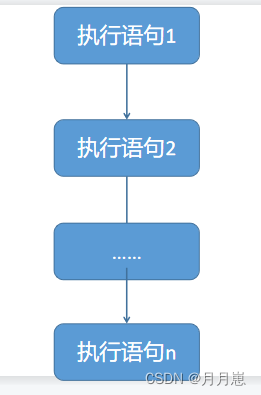
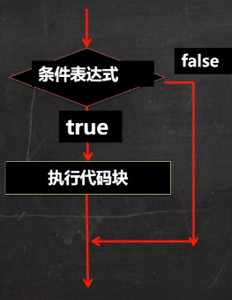
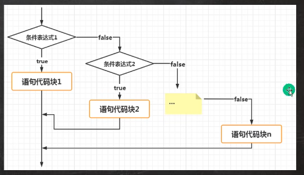
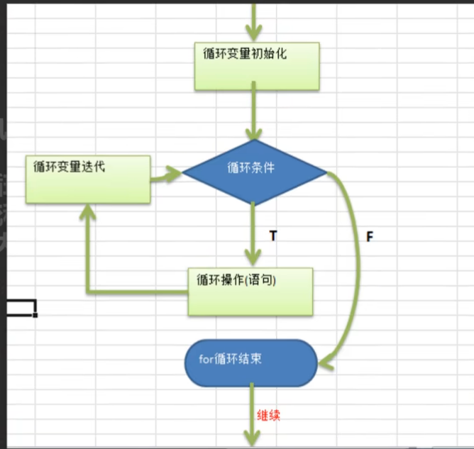
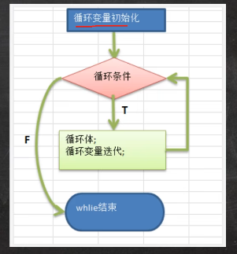
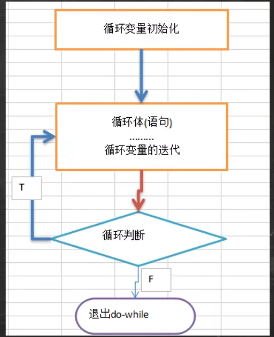

# 控制结构

## 顺序控制

程序从上到下的逐步执行，中间没有任何的判断和跳转。

**顺序控制举例**

Java中定义变量时采用合法的向前引用

~~~java
public class Test{
    int n1=11;
    int n2=n1+2;
}

//错误形式：
public class Test{
    int n2=n1+2;//错误
    int n1=11;
}
   
~~~

## 分支控制

让程序有选择的执行

### 单分支 if

**基本语法**

~~~java
if(条件表达式){
    执行代码块;
}
~~~

`注：`当条件表达式为true时就会执行{ }的代码，如果为false就不执行
如果{ }中只有一条语句，则可以不用{ },`建议写上{ }`

**例子**

~~~java
public class If01 {
    public static void main(String[] args) {
        Scanner myScanner=new Scanner(System.in);
        int age= myScanner.nextInt();
        if(age>=18){
            System.out.println("你成年了");
        }
    }
}
~~~

### 双分支 if.....else

**基本语法**

~~~java
if(条件表达式){
    代码块1；
}else{
    代码块2；
}
~~~

`注：`当条件表达式成立，也就是为true，则执行代码块1，否则执行代码块2

**例子**

~~~java
public class If02 {
	public static void main(String[] args) {
		int x = 10;
		int y = 20;
		 if( x < y ) {   //进行判断
			 System.out.print("x小于y");   //判断为true执行的语句
		 }else {                          
			 System.out.print("x大于y");  //判断为false执行的语句
		 }
	}
}
~~~

### 多分支 if-else if -....-else

**基本语法**

~~~java
if(条件表达式1){
    代码块1；
}else if(条件表达式2){
    代码块2；
}
......
else{
    代码块3；
}
 
//当条件表达式1成立，执行代码块1；条件表达式1不成立，
//执行条件表达式2，条件表达式2成立，执行代码块2，不成立执行代码块3
~~~

`注：`多分支可以没有else,如果所有的条件表达式都不成立，则应该执行入口都没有，如果有else如果所有的条件表达式都不成立，则默认执行else代码块

**例如**

~~~java
public class If03 {
    public static void main(String[] args) {
        Scanner myScanner=new Scanner(System.in);
        //接收信用分
        int n= myScanner.nextInt();
        if(n==100){
            System.out.println("信用极好");
        }else if(n>80){
            System.out.println("信用优秀");
        }else if(n>=60){
            System.out.println("信用一般");
        }else{
            System.out.println("信用不及格");
        }
    }
}
~~~

### 嵌套分支

在一个分支结构中又完整的嵌套了另一个完整的分支结构，里面的分支结构称为内层分支，外面的分支结构称为外层分支，`规范：不要超过3层(可读性不好)`

**基本语法**

~~~java
if(条件判断1){
   if(条件判断2){
      语句块1
   }else{
      语句块2
   }
}else{
     if(条件判断3){
      语句块3
   }else{
      语句块4   
   }
}
~~~

**例子**

~~~java
public class NestedIf {
    public static void main(String[] args) {
        Scanner myScanner=new Scanner(System.in);
        double score= myScanner.nextDouble();
        char gender=myScanner.next().charAt(0);//字符输入
        if(score>8.0){
            if(gender=='男'){
                System.out.println("进入男子组决赛");
            }else{
                System.out.println("进入女子组决赛");
            }
        }else{
            System.out.println("没有进入决赛");
        }
    }
}
~~~

`注意：`else总是和离它最近的if进行匹配，在if语句嵌套时，尽可能使用花括号进行划分逻辑关系，避免出现问题。

### switch

switch语句属于多分支结构，可以替代复杂的if-else-if语句。表达式的结果类型只能是byte、short、int或char类型。switch语句是多分支的开关语句，基本语法格式为：

~~~java
switch(表达式){
    case 常量表达式1:语句组1;
                    break;
    case 常量表达式2:语句组2;
                    break;
    case 常量表达式3:语句组3;
                    break;
    ...
    default: 语句组n
}
~~~

`说明`

- switch关键字，表示switch分支

- switch 语句中的变量类型可以是： byte、short、int 或者 char。从 Java SE 7 开始，switch 支持字符串 String 类型了，同时 case 标签必须为字符串常量或字面量；
- switch 语句可以拥有多个 case 语句。每个 case 后面跟一个要比较的值和冒号；
- case 语句中的值的`数据类型必须与变量的数据类型相同`，而且只能是常量或者字面常量；
- 当变量的值与 case 语句的值相等时，那么 case 语句之后的语句开始执行，`直到 break 语句出现`才会跳出 switch 语句；
- 当遇到 break 语句时，switch 语句终止。程序跳转到 switch 语句后面的语句执行。case 语句不必须要包含 break 语句。如果没有 break 语句出现，程序会继续执行下一条 case 语句，直到出现 break 语句；
- switch 语句可以包含一个 default 分支，该分支一般是 switch 语句的最后一个分支（可以在任何位置，但建议在最后一个）。default 在没有 case 语句的值和变量值相等的时候执行。default 分支不需要 break 语句。

**例子**：

~~~java
public class Switch {
    public static void main(String[] args) {
        Scanner myScanner = new Scanner(System.in);
        char n = myScanner.next().charAt(0);
        switch (n) {
            case 'a':
                System.out.println("星期一");
                break;
            case 'b':
                System.out.println("星期二");
                break;
            case 'c':
                System.out.println("星期三");
                break;
            case 'd':
                System.out.println("星期四");
                break;
            case 'e':
                System.out.println("星期五");
                break;
            case 'f':
                System.out.println("星期六");
                break;
            case 'g':
                System.out.println("星期七");
                break;
            default:
                System.out.println("输入的字符不在范围内");
        }
    }
}
~~~

### switch和if比较

1. 如果判断的具体数值不多，而且符合byte，short，int，char，enum，String这6种类型，建议使用switch
2. 其他情况：对区间判断，对结果为boolean类型判断使用if

## 循环控制

### for循环

**基本语法**

~~~java
for(循环变量初始化;循环条件;循环变量迭代){
    循环体语句
}
~~~

执行顺序：循环变量初始化--> 循环条件 --> 循环操作 --> 循环变量迭代

执行过程如下：

1. 执行循环变量初始化
2. 进行条件判断，值为true时，则执行后面的循环体语句，否则结束循环；
3. 执行循环变量迭代，改变循环变量的值；
4. 重复执行上述2,3这两个步骤，开始下一次循环，直到条件判断为false，结束整个循环语句。

`注意：`

- 循环条件返回的是一个boolean值，如果这个条件为false，则不再往下走
- for(;循环条件;){ }循环变量初始化和循环变量迭代可以写到别的地方，但是分号不能省
- 循环变量初始化只在循环前执行一次

**例如**

~~~java
public class For01 {
    public static void main(String[] args) {
        for (int i = 1; i <= 10; i++) {
            System.out.println("要好好学习");//输入这条语句10次
        }
    }
}
~~~

### while循环

while循环是最基本的循环，它首先判断循环条件是否满足，如果第一次循环条件不满足的话，那么直接跳出循环，循环操作一遍都不会执行，特点为：先判断，后执行。

**语法格式为**：

~~~java
while( 条件判断 ) {
  //循环内容
  //循环变量迭代
}
~~~

while是关键字，循环条件是一个布尔表达式，结果为true时执行循环，否则结束循环

**例如**

~~~java
public class while01 {
    public static void main(String[] args) {
        int i = 1;//循环变量初始化
        while (i <= 10) {//循环条件
            System.out.println("好好学习");//执行语句
            i++;//循环变量迭代
        }
    }
}
~~~

### do.....while循环

do-while语句与while语句相似，可以完成相同的功能，但do-while循环是先执行do后面的循环体语句，然后对while后面的条件判断进行判断，如果为true，则再次执行do后面的循环体语句，否则结束循环。特点为：先执行，后判断，`do…while 循环至少会执行一次`

**基本语法**

~~~java
do{
     语句块
}while(条件判断):
~~~

**例如**

~~~java
public class DoWhile {
    public static void main(String[] args) {
        int i = 1;
        do {
            System.out.println("好好学习");
            i++;
        } while (i <= 10);
    }
}
~~~

### 多重循环

一个循环放在另一个循环中，就形成了嵌套循环(`嵌套循环一般不要超3层`)！

实际上循环嵌套就是把内层循环当成外层循环的循环体。只有内层循环为false，才会跳出这次内层循环，然后结束这一次外层循环。开始下次一外层循环.

~~~java
public class Muifor {
    public static void main(String[] args) {
        for (int i = 0; i < 2; i++) {
            for (int j = 0; j < 3; j++) {
                System.out.println("i=" + i + " j=" + j);
            }
        }
    }

}
~~~

## 跳出控制语句

为了在程序中更好地控制循环操作进行流程跳转，我们就需要跳转语句了。跳转语句包括break、continue和return。

break与continue的区别是：

- continue语句只是结束本次循环，而不是结束整个循环；
- break语句则是结束整个循环过程，不再判断执行循环的条件是否成立。

### break

break语句则是结束整个循环过程，不再判断执行循环的条件是否成立，用法很简单

- break 主要用在循环语句或者 switch 语句中，用来跳出整个语句块
- break 跳出最里层的循环，并且继续执行该循环下面的语句

~~~java
public class myfirst {
	public static void main(String[] args) {
		 int [] numbers = {10, 20, 30, 40, 50};
	      for(int x : numbers ) {
	         if( x == 30 ) {      // x 等于 30 时跳出循环
	            break;
	         }
	         System.out.print( x );
	         System.out.print("\n");
	      }
	}
}
~~~

~~~java
10
20
~~~

### continue

continue语句只是结束本次循环，而不是结束整个循环，continue 适用于任何循环控制结构中。作用是让程序立刻跳转到下一次循环的迭代。

- 在 for 循环中，continue 语句使程序立即跳转到更新语句。
- 在 while 或者 do…while 循环中，程序立即跳转到布尔表达式的判断语句。

~~~java
public class myfirst {
	public static void main(String[] args) {
		int [] numbers = {10, 20, 30, 40, 50};
	      for(int x : numbers ) {
	         if( x == 30 ) {//x=30时跳到下一个循环条件
	        continue;
	         }
	         System.out.print( x );
	         System.out.print("\n");
	      }
	}
}
~~~

~~~java
10
20
40
50
~~~

#### return

return语句是终止当前方法运行，返回到调用该方法的语句处，该语句还提供相应返回值

~~~java
public boolean isPlus(int x){
    if(x>=0){
        return true;
    }
return false;
    }
~~~

当if条件语句结构为true时，执行第一个return语句（return true），退出方法。下面（return false ）跳过不执行

### 生成随机数

~~~java
  System.out.println((int)(Math.random() * 100) + 1);
~~~

