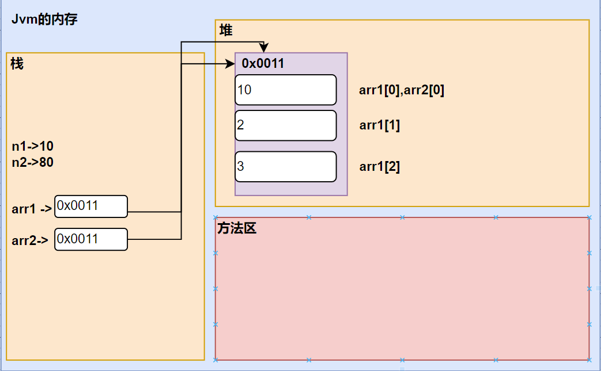
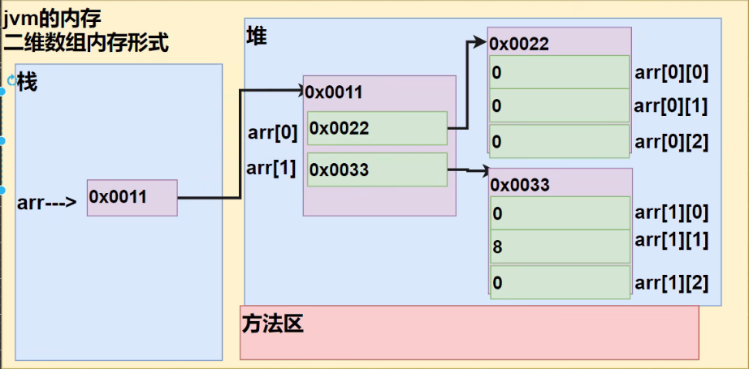
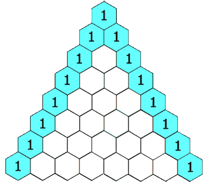
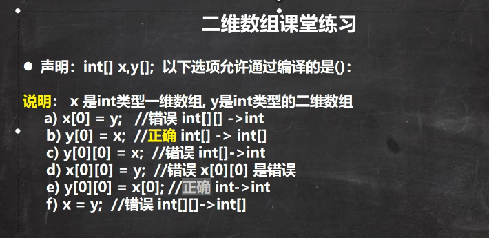

# 数组

## 数组

### 为什么需要数组

有五个学生，他们英语成绩分别为60,70,90,80,50.用程序求几个同学总成绩是多少，平均分多少？

常规写法：定义五个变量，加起来就是总成绩，除以5就是平均成绩。这样定义很多变量是的程序非常繁琐。我们可以用数组来实现这个问题。

### 数组的介绍

数组可以存放`多个同一类型`的数据，数组也是一种数据类型，是引用类型

### 数组快速入门

我们通过代码实现上面五个学生的问题：

~~~java
public class Array01 {
    public static void main(String[] args) {
        //有五个学生，他们英语成绩分别为60,70,90,80,50用程序求几个同学总成绩是多少，平均分多少？
        //传统方式：
        double s1 = 60;
        double s2 = 70;
        double s3 = 90;
        double s4 = 80;
        double s5 = 50;
        double sum = s1 + s2 + s3 + s4 + s5;
        double avg = sum / 5;
        System.out.println("总成绩为："+ sum + ", 平均成绩为："+ avg);

        //以上这种方式难免有些繁琐了，我们使用数组可以很简单的解决这个问题。
        //1.定义一个double类型的数组，把成绩存到数组中
        double[] arrays = {60,70,90,80,50};
        //2.数组是从0开始，所以下标为arrays[0]就是第一个数；第二个数就是arrays[1],以此类推...
        //3.通过for循环可以访问数组的5个元素值
        double sum2 = 0;
        for(int i = 0 ; i < arrays.length ; i++){
            sum2 += arrays[i];
        }
        System.out.println("总成绩为："+ sum2 + ", 平均成绩为："+ sum2/arrays.length);
        
    }
}
~~~

### 数组初始化

**动态初始化**

> 数据类型 数组名[]=new 数据类型[大小/长度]；
> 数据类型[] 数组名=new 数据类型[大小/长度]；
> int a[]=new int[5];//创建了一个数组，名字啊，存放给int

数组的使用：数组名[下标/索引]，数组的`下标是从0开始`
数组的最大索引值为`数组名.length-1`

`注意：`数组有定长特性，长度一旦指定，不可更改

~~~java
int[] arr = new int[3];  
int   arr[] = new int[3];
// 可以拆分 
int[] arr;
arr = new int[3];
~~~

**静态初始化**

> 数据类型[] 数组名 = new 数据类型[]{元素1,元素2,元素3…};

~~~java
int[] arr = new int[]{1,2,3,4,5}; 
// 可以拆分 
int[] arr;
arr = new int[]{1,2,3,4,5};
~~~

> 省略格式：
>
> 数据类型[] 数组名 = {元素1,元素2,元素3…};//不能拆分

~~~java
int[] arr = {1,2,3,4,5};
~~~

### 数组使用细节


1. 数组是多个`相同类型数据`的组合，实现对这些数据的统一管理

2. 数组中的元素可以是任何数据类型，包括基本数据类型和引用，但是不能混用

3. 数组创建后，如果没有赋值，有默认值
   ~~~java
   int 0；short 0；byte 0；long 0；float 0.0, double 0.0，char \u0000，boolean false，String null
   ~~~

4. 使用数组的步骤1.声明数组并开辟空间，2.给数据各个元素赋值，3.使用数组

5. 数组的`下标是从0开始`

6. 数组下标必须在指定范围内使用，否则报：下标越界异常

7. 数组属于引用类型，数组型数据是对象

### Java虚拟机的内存划分

为了提高运算效率就对空间进行了不同区域的划分，因为每一片区域都有特定的处理数据方式和内存管理方式

JVM的内存划分

| 区域名称   | 作用                                                       |
| ---------- | ---------------------------------------------------------- |
| 寄存器     | 给CPU使用，和我们开发无关。                                |
| 本地方法栈 | JVM在使用操作系统功能的时候使用，和我们开发无关。          |
| 方法区     | 存储可以运行的class文件。                                  |
| 堆内存     | 存储对象或者数组，new来创建的，都存储在堆内存。            |
| 方法栈     | 方法运行时使用的内存，比如main方法运行，进入方法栈中执行。 |

1. 栈(Stack):存放的都是方法中的局部变量，方法的运行一定要在栈中运行
   局部变量：方法的参数或者是方法{}内部的变量
   作用域：一旦超出作用域，立刻从栈内存当中消失
2. 堆(Heap):凡是new出来的东西，都在堆当中
   堆内存里面的东西都有一个地址值：16进制
   堆内存里面的数据，都有默认值，规则：
   1. 整数 0
   2. 浮点数 0.0
   3. 字符 ‘\u0000’
   4. 布尔 false
   5. 引用类型 null
3. 方法区(Method Area)：存储.class相关信息，包含方法的信息
4. 本地方法栈：与操作系统相关
5. 寄存器：与CPU相关

### 数组赋值机制

1. 基本数据类型赋值，这个值就是具体的数据，互不影响
2. 数组在默认情况下是引用传递，赋值的值是地址

~~~java
public class ArrayAssign {
    public static void main(String[] args) {
        //基本数据类型赋值
        int n1 = 10;
        int n2 = n1;
        n2 = 80;
        System.out.println(n1);//10
        System.out.println(n2);//80

        //数组在默认情况下是引用传递，赋的值是地址，赋值方式为引用传达
        //是一个地址，arr2变化会影响到arr1
        int[] arr1 = {1, 2, 3};
        int[] arr2 = arr1;//把arr1赋给arr2
        arr2[0] = 10;
    }
}
~~~



### 数组拷贝

将int[] arr1 = {11,22,33}；拷贝到arr2数组中

~~~java
public class ArrayCopy {
    public static void main(String[] args) {
        //将int[] arr1 = {11,22,33}；拷贝到arr2数组中
        int[] arr1 = {11, 22, 33};
        int[] arr2 = new int[arr1.length];

        //把arr1的所有元素赋到arr2中
        for (int i = 0; i < arr1.length; i++) {
            arr2[i] = arr1[i];
        }
        //输出arr2
        for (int i = 0; i < arr2.length; i++) {
            System.out.println(arr2[i]);//11，22，33
        }
    }
}
~~~

或者

~~~java
public class ArrayCopy {
    public static void main(String[] args) {
        //将int[] arr1 = {11,22,33}；拷贝到arr2数组中
        int[] arr1 = {11, 22, 33};
        int[] arr2 = new int[arr1.length];

        //把arr1的所有元素赋到arr2中
        System.arraycopy(arr1, 0, arr2, 0, arr1.length);
        for (int i = 0; i < arr2.length; i++) {
            System.out.println(arr2[i]);
        }

    }
}
~~~

------

### 数组反转

把数组中的数反转：arr{11,22,33,44,55,66}  arr{66,55,44,33,22,11}

逆序赋值的方式：

~~~java
public class ArrayReverse02 {
    public static void main(String[] args) {
        int[] arr = {11, 22, 33, 44, 55, 66};
        //创建一个空的且同等大小的数组
        int[] arr2 = new int[arr.length];
        //逆序遍历
        for (int i = arr.length - 1, j = 0; i >= 0; i--, j++) {
            arr2[j] = arr[i];
        }
        //当for循环结束，arr2就是一个逆序的数组{66，55，44，33，22，11}
        //让arr指向arr2数据空间，此时arr原来的数据空间就没有变量引用
        //会被当做垃圾，销毁
        arr = arr2;
        //输出arr
        for (int i = 0; i < arr.length; i++) {
            System.out.println(arr[i]);
        }
    }
}

~~~

**方式二**

~~~java
public class ArrayReverse {
    public static void main(String[] args) {
        //数组反转
        int[] arr = {11, 22, 33, 44, 55, 66};
        //规律
        //1.把arr[0]和arr[5]进行交换
        //2.把arr[1]和arr[4]进行交换
        //3.把arr[2]和arr[3]进行交换
        int temp = 0;
        for (int i = 0; i < arr.length / 2; i++) {
            temp = arr[arr.length - 1 - i];
            arr[arr.length - 1 - i] = arr[i];
            arr[i] = temp;
        }

        for (int i = 0; i < arr.length; i++) {
            System.out.println(arr[i]);
        }
    }
}
~~~

### 数组扩容

~~~java
public class ArrayAdd {
    public static void main(String[] args) {
        //思路分析
        //定义初始数组
        //定义一个新的数组
        //遍历arr数组，依次将arr的元素拷贝到arrNew数组
        //将4赋给arrNew数组，把4赋给arrNew最后一个元素
        //让arr指向arrNew;
        int[] arr = {1, 2, 3};
        int[] arrNew = new int[arr.length + 1];
        for (int i = 0; i < arr.length; i++) {
            arrNew[i] = arr[i];
        }
        arrNew[arrNew.length - 1] = 4;
        arr=arrNew;
    }
}

~~~

**动态的添加数组**

~~~java
public class ArrayAdd {
    public static void main(String[] args) {
        //思路分析
        //定义初始数组
        //定义一个新的数组
        //遍历arr数组，依次将arr的元素拷贝到arrNew数组
        //将4赋给arrNew数组，把4赋给arrNew最后一个元素
        //让arr指向arrNew;
        Scanner myScanner = new Scanner(System.in);
        int[] arr = {1, 2, 3};
        do {
            int[] arrNew = new int[arr.length + 1];
            System.arraycopy(arr, 0, arrNew, 0, arr.length);
            System.out.println("请输入要添加的元素");

            arrNew[arrNew.length - 1] = myScanner.nextInt();
            arr = arrNew;
            for (int i = 0; i < arr.length; i++) {
                System.out.println(arr[i]);
            }
            //问用户是否继续
            System.out.println("请输入y/n");
            char ch = myScanner.next().charAt(0);
            if (ch == 'n') {
                break;
            }
        } while (true);
    }
}
~~~


### 数组缩减

## 排序

排序是将多个数据，依指定的顺序进行排列的过程

排序的分类:

内部排序：将需要处理的所有数据都加载到内部存储器中进行排序，包括(交换式排序法，选择式排序法和插入式排序法)

外部排序法：数据量过大，无法全部加载到内存中，需要借助外部存储器进行排序，包括(合并排序法和直接排序法)

## 冒泡排序

通过对待排序序列从后向前(从下标较大的元素开始)，依次比较相邻元素的值，若发现逆序则交换，使值较大的元素逐渐从前移向后部，就像水底下的气泡一样逐渐向上冒


```java
public class BubbleSort {
    public static void main(String[] args) {
        int[] arr = {24, 69, 80, 57, 12};
        int temp;
        for (int i = 0; i < arr.length - 1; i++) {
            for (int j = 0; j < arr.length - 1 - i; j++) {
                if (arr[j] > arr[j + 1]) {
                    temp = arr[j + 1];
                    arr[j + 1] = arr[j];
                    arr[j] = temp;
                }
            }
        }
        for (int i = 0; i < arr.length; i++) {
            System.out.println(arr[i]);
        }
    }
}
```

## 查找

**顺序查找**

字符串比较用 equals函数

~~~java
public class SaqSearch {
    public static void main(String[] args) {
        Scanner myScanner = new Scanner(System.in);
        //定义数组
        String[] arr = {"喜羊羊", "沸羊羊", "美羊羊", "懒洋洋"};
        //输入要查找的数据
        //编程思想
        int index = -1;
        String sheep = myScanner.next();
        for (int i = 0; i < arr.length; i++) {
            //比较两个字符串是否相等(相同)
            if (arr[i].equals(sheep)) {
                System.out.println("找到了下标为 " + i);
                //找到变一
                index = 1;
                break;
            }
        }
        //没有找到
        if (index != 1) {
            System.out.println("没有找到");
        }
    }
}
~~~

## 二位数组

二维数组就是原来的一维数组的每个元素是一维数组，就构成二维数组

### **二维数组初始化**

同一维数组一样，共有4总不同形式的定义方法：

```java
int[][] array1 = new int[10][10];
int[] array3[]//也是二维数组的声明方式
int array2[][] = new int[10][10];
int array3[][] = { { 1, 1, 1 }, { 2, 2, 2 } };
int array4[][] = new int[][] { { 1, 1, 1 }, { 2, 2, 2 } };
```

**不定长二维数组**

每个一维数组的长度都不一样

```java
int[][] array = new int[3][];
array[0] = new int[1];
array[1] = new int[2];
array[2] = new int[3];
```

**获取二维数组的长度**

```java
int length1 = array.length;
int length2 = array[0].length;
// 获取二维数组的第一维长度（3）
System.out.println(length1);
// 获取二维数组的第一维的第一个数组长度（1）
System.out.println(length2);
```

**案例**

~~~java
public class TowDimensionalArray02 {
    public static void main(String[] args) {
        int[][] arr = new int[2][3];
        arr[1][1] = 8;
        for (int i = 0; i < arr.length; i++) {
            for (int j = 0; j < arr[i].length; j++) {
                System.out.print(arr[i][j] + "\t");
            }
            System.out.println();
        }
    }
}
~~~

**JVM内存图**



### 杨辉三角



~~~java
public class YangHui {
    public static void main(String[] args) {
        Scanner myScanner = new Scanner(System.in);
        //输入打印行数
        int rows = myScanner.nextInt();
        int[][] arr = new int[rows][];
        for (int i = 0; i < arr.length; i++) {
            //给每个一维数组开空间
            arr[i] = new int[i + 1];
            for (int j = 0; j < arr[i].length; j++) {
                //每行第一个数和最后一个数是1
                if (j == 0 || i == j) {
                    arr[i][j] = 1;
                } else {
                    //其余的数是前一行的j-1和j的相加得到
                    arr[i][j] = arr[i - 1][j - 1] + arr[i - 1][j];
                }
            }
        }

        for (int i = 0; i < arr.length; i++) {
            //打印空格字符串
            System.out.format("%" + (rows - i) * 2 + "s", "");
            for (int j = 0; j <= i; j++) {
                //输出杨辉三角
                System.out.printf("%6d", arr[i][j]);
            }
            System.out.println();
        }
    }
}
~~~

### 二维数组练习题


